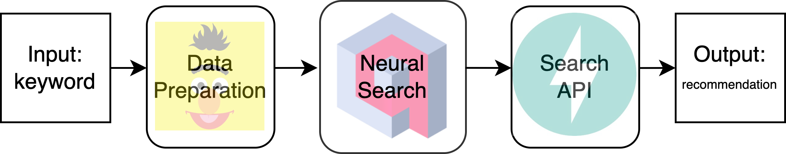

# Movies recommendation based on Qdrant
Inspired by the *[Qdrant startup demo](https://demo.qdrant.tech/#/)*, I think keyworks searching could be recommendation. Based on I am a huge fan of movies, movies recommendation came into my brain.

## Let see what it is

Type any keyword which you have interested in for a story, the words go through the pipeline then give an answer based on neural search.

***
### Tutorial
:point_right: Based on the baby tutorial for who first time to try *[Qdrant](https://blog.qdrant.tech/neural-search-tutorial-3f034ab13adc)*

***
### Data resource
*[American movies scraped from Wikipedia](https://raw.githubusercontent.com/prust/wikipedia-movie-data/master/movies.json)*

If you have any interested in other good free public data, :point_right: explore more *[Awesome JSON Datasets](https://github.com/jdorfman/awesome-json-datasets#movies)*

***
## First prepare the data
 1) Collect the useful information from *movies.json* ('title', 'year', 'cast', 'extract')
 2) Cover it into the vector using **SentenceTransformer**
 
## Second prepare the vector search engine
 1) Using **docker** to start **Qdrant**
 2) Active *int_vector_search.py* to collect and upload the data into Qdrant
 
## Last use FastAPI  
 1) Define how to give the recommedation in *NeuralSearcher.py*
 2) *service.py*
 
